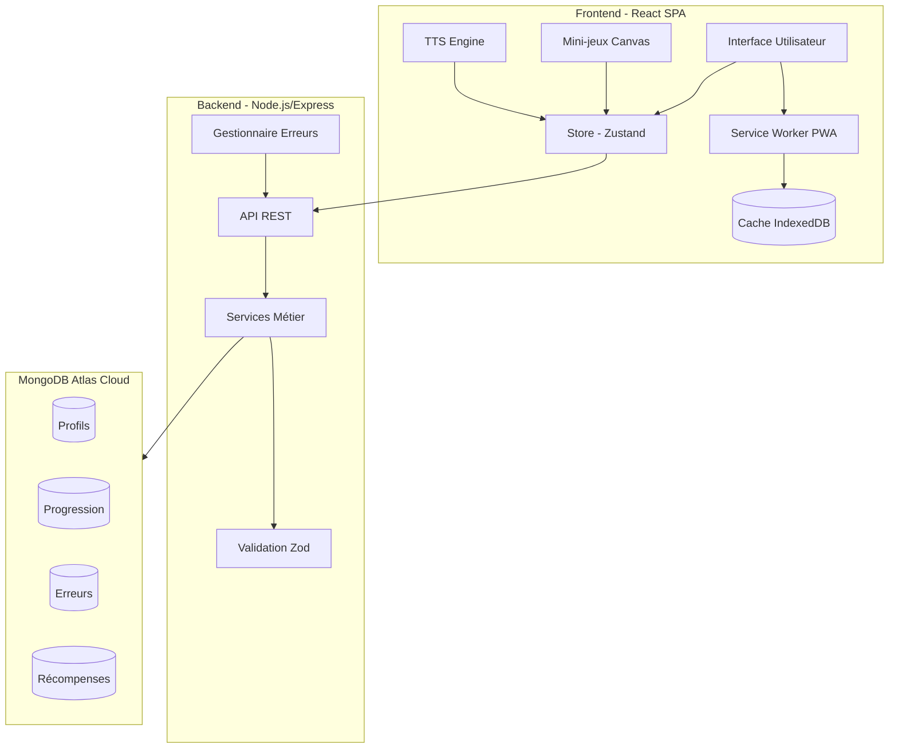

# Architecture de l'Application d'Apprentissage de la Lecture

## Vue d'ensemble

Cette application web progressive (PWA) est conçue pour aider les enfants de 3 à 10 ans à apprendre à lire en français de manière ludique. L'architecture est construite pour être performante, accessible et résiliente hors-ligne.



## Structure du Projet

```
lectio-app/
├── client/                      # Application React (SPA)
│   ├── src/
│   │   ├── components/         # Composants React réutilisables
│   │   ├── games/             # Implémentation des mini-jeux
│   │   ├── pages/             # Pages/Routes de l'application
│   │   ├── store/             # Store Zustand et logique état
│   │   ├── services/          # Services API et utilitaires
│   │   ├── hooks/             # Hooks React personnalisés
│   │   ├── assets/            # Images, sons, polices
│   │   └── utils/             # Utilitaires et helpers
│   ├── public/                # Assets statiques et manifest PWA
│   └── index.html             # Point d'entrée HTML
│
├── server/                     # Backend Node.js/Express
│   ├── src/
│   │   ├── controllers/       # Contrôleurs REST
│   │   ├── models/           # Modèles Mongoose
│   │   ├── services/         # Logique métier
│   │   ├── middleware/       # Middlewares Express
│   │   ├── routes/           # Définition des routes
│   │   ├── utils/            # Utilitaires
│   │   └── config/           # Configuration
│   └── seeds/                # Scripts de données initiales
│
└── shared/                    # Code partagé client/serveur
    ├── types/                # Types TypeScript
    ├── constants/            # Constantes partagées
    └── validation/           # Schémas de validation
```

## Documents d'Architecture

- [Architecture Frontend](./frontend-architecture.md) - Structure React, composants et état
- [Architecture Backend](./backend-architecture.md) - Structure Express et services
- [Schéma Base de Données](./database-schema.md) - Modèles MongoDB et relations
- [Spécification API](./api-specification.md) - Documentation API REST
- [Diagrammes Techniques](./technical-diagrams.md) - Flux et séquences

## Stack Technique

### Frontend
- React 18 + Vite
- Zustand (gestion état)
- Tailwind CSS + Radix UI
- Canvas API / Pixi.js
- Web Speech API
- Workbox (PWA)

### Backend
- Node.js 20+
- Express 4
- MongoDB + Mongoose
- Zod (validation)
- Pino/Morgan (logs)

### Qualité & Tests
- TypeScript
- ESLint + Prettier
- Vitest/Jest
- Playwright (E2E)
- axe-core (a11y)

## Points d'Architecture Clés

1. **Résilience Offline**
   - PWA avec precaching des assets
   - IndexedDB pour données locales
   - File d'attente de synchronisation

2. **Performance**
   - Lazy loading des jeux
   - Bundle splitting
   - Cache stratégique des assets

3. **Accessibilité**
   - ARIA intégré
   - Support TTS natif
   - Thèmes accessibles

4. **Sécurité**
   - Validation stricte (Zod)
   - CORS + Helmet
   - CSP restrictif