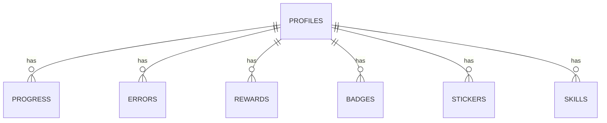

# Schéma de la Base de Données MongoDB

## Collections et Schémas

### Collection: profiles

````markdown
# Schéma relationnel PostgreSQL

Ce document décrit les tables relationnelles pour la version PostgreSQL (Prisma compatible).

## Tables (SQL)

### profiles

```sql
CREATE TABLE profiles (
  id SERIAL PRIMARY KEY,
  pseudo VARCHAR(20) NOT NULL,
  age INTEGER CHECK (age BETWEEN 3 AND 10),
  avatar_key VARCHAR(50) NOT NULL,
  font_preference VARCHAR(20) DEFAULT 'default',
  contrast_mode VARCHAR(10) DEFAULT 'normal',
  reduce_motion BOOLEAN DEFAULT false,
  session_minutes INTEGER DEFAULT 15,
  created_at TIMESTAMP WITH TIME ZONE DEFAULT now(),
  updated_at TIMESTAMP WITH TIME ZONE DEFAULT now()
);
```

### progress

```sql
CREATE TABLE progress (
  id SERIAL PRIMARY KEY,
  profile_id INTEGER NOT NULL REFERENCES profiles(id) ON DELETE CASCADE,
  world INTEGER CHECK (world BETWEEN 1 AND 3),
  level INTEGER CHECK (level BETWEEN 1 AND 4),
  stars INTEGER CHECK (stars BETWEEN 0 AND 3) DEFAULT 0,
  xp INTEGER DEFAULT 0,
  attempts_count INTEGER DEFAULT 0,
  last_played_at TIMESTAMP WITH TIME ZONE DEFAULT now(),
  UNIQUE(profile_id, world, level)
);
```

### skills

```sql
CREATE TABLE skills (
  id SERIAL PRIMARY KEY,
  profile_id INTEGER NOT NULL REFERENCES profiles(id) ON DELETE CASCADE,
  skill_key VARCHAR(50) NOT NULL,
  success_rate NUMERIC(4,3) DEFAULT 0.0,
  updated_at TIMESTAMP WITH TIME ZONE DEFAULT now(),
  UNIQUE(profile_id, skill_key)
);
```

### errors

```sql
CREATE TABLE errors (
  id SERIAL PRIMARY KEY,
  profile_id INTEGER NOT NULL REFERENCES profiles(id) ON DELETE CASCADE,
  skill_key VARCHAR(50) NOT NULL,
  word VARCHAR(100) NOT NULL,
  expected VARCHAR(100) NOT NULL,
  given VARCHAR(100) NOT NULL,
  created_at TIMESTAMP WITH TIME ZONE DEFAULT now()
);
```

### rewards

```sql
CREATE TABLE rewards (
  id SERIAL PRIMARY KEY,
  profile_id INTEGER NOT NULL REFERENCES profiles(id) ON DELETE CASCADE,
  total_xp INTEGER DEFAULT 0,
  current_level INTEGER DEFAULT 1,
  UNIQUE(profile_id)
);
```

### badges

```sql
CREATE TABLE badges (
  id SERIAL PRIMARY KEY,
  profile_id INTEGER NOT NULL REFERENCES profiles(id) ON DELETE CASCADE,
  badge_key VARCHAR(50) NOT NULL,
  level INTEGER DEFAULT 1,
  earned_at TIMESTAMP WITH TIME ZONE DEFAULT now(),
  UNIQUE(profile_id, badge_key)
);
```

### stickers

```sql
CREATE TABLE stickers (
  id SERIAL PRIMARY KEY,
  profile_id INTEGER NOT NULL REFERENCES profiles(id) ON DELETE CASCADE,
  sticker_key VARCHAR(50) NOT NULL,
  unlocked_at TIMESTAMP WITH TIME ZONE DEFAULT now(),
  UNIQUE(profile_id, sticker_key)
);
```

## Relations (ER)



## Prisma schema (extrait)

```prisma
generator client {
  provider = "prisma-client-js"
}

datasource db {
  provider = "postgresql"
  url      = env("DATABASE_URL")
}

model Profile {
  id             Int       @id @default(autoincrement())
  pseudo         String    @db.VarChar(20)
  age            Int
  avatarKey      String    @db.VarChar(50)
  fontPreference String?   @db.VarChar(20)
  contrastMode   String?   @db.VarChar(10)
  reduceMotion   Boolean   @default(false)
  sessionMinutes Int?      @default(15)
  createdAt      DateTime  @default(now())
  updatedAt      DateTime  @updatedAt
  Progress       Progress[]
  Skills         Skill[]
  Errors         Error[]
  Reward         Reward?
}

model Progress {
  id           Int      @id @default(autoincrement())
  profile      Profile  @relation(fields: [profileId], references: [id])
  profileId    Int
  world        Int
  level        Int
  stars        Int      @default(0)
  xp           Int      @default(0)
  attempts     Int      @default(0)
  lastPlayedAt DateTime @default(now())
  @@unique([profileId, world, level])
}

model Skill {
  id          Int     @id @default(autoincrement())
  profile     Profile @relation(fields: [profileId], references: [id])
  profileId   Int
  key         String  @db.VarChar(50)
  successRate Float   @default(0)
  updatedAt   DateTime @default(now())
  @@unique([profileId, key])
}

model Error {
  id        Int      @id @default(autoincrement())
  profile   Profile  @relation(fields: [profileId], references: [id])
  profileId Int
  skillKey  String
  word      String
  expected  String
  given     String
  createdAt DateTime @default(now())
}

model Reward {
  id           Int    @id @default(autoincrement())
  profile      Profile @relation(fields: [profileId], references: [id])
  profileId    Int    @unique
  totalXP      Int    @default(0)
  currentLevel Int    @default(1)
}
```

## Notes d'implémentation

- Prévoir migrations via `prisma migrate`.
- Indexer les colonnes fréquemment interrogées (profile_id, last_played_at).
- Utiliser ON DELETE CASCADE pour nettoyer les données liées lors de suppression d'un profil.
````