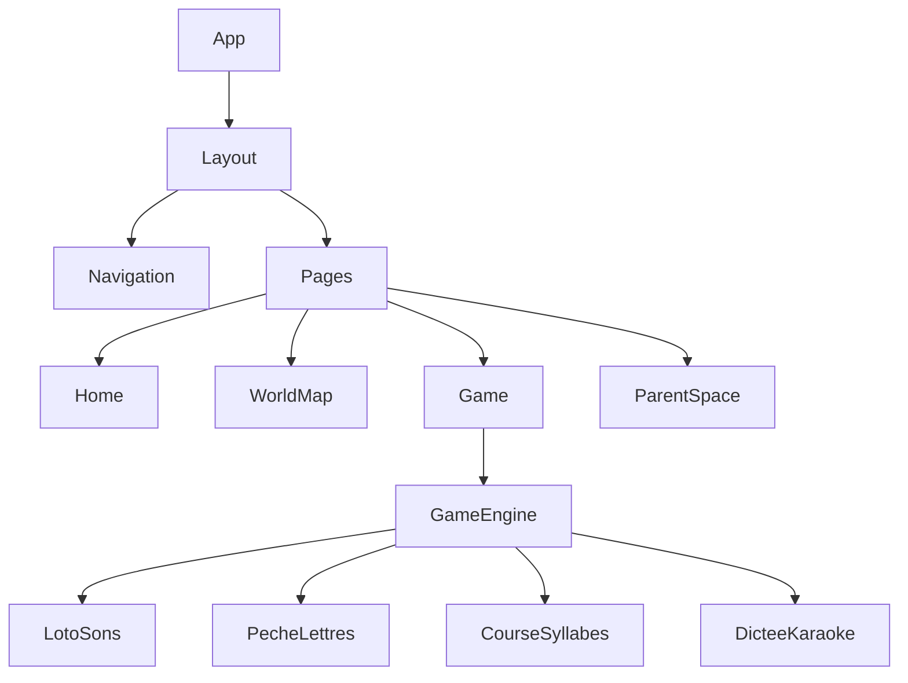

# Architecture Frontend

## Structure des Dossiers

```
client/
├── src/
│   ├── components/           # Composants React réutilisables
│   │   ├── common/          # Composants génériques (Button, Input...)
│   │   ├── games/           # Composants spécifiques aux jeux
│   │   ├── layout/          # Layout, navigation, modales
│   │   └── widgets/         # Widgets complexes (ProgressBar, Rewards...)
│   │
│   ├── games/               # Logique des mini-jeux
│   │   ├── core/           # Moteur de jeu partagé
│   │   ├── loto-sons/      # Jeu 1: Loto des sons
│   │   ├── peche-lettres/  # Jeu 2: Pêche aux lettres
│   │   ├── course-syllabes/ # Jeu 3: Course des syllabes
│   │   └── dictee-karaoke/ # Jeu 4: Dictée karaoké
│   │
│   ├── pages/              # Pages de l'application
│   │   ├── Home/          # Accueil/Sélection profil
│   │   ├── WorldMap/      # Carte des mondes
│   │   ├── Game/          # Page de jeu
│   │   └── ParentSpace/   # Espace parent
│   │
│   ├── store/             # État global Zustand
│   │   ├── slices/       # Découpage logique de l'état
│   │   │   ├── profile.ts    # Gestion profil
│   │   │   ├── progress.ts   # Progression/niveaux
│   │   │   ├── game.ts       # État du jeu en cours
│   │   │   └── settings.ts   # Paramètres
│   │   └── index.ts      # Store principal
│   │
│   ├── services/          # Services et API
│   │   ├── api/          # Client API REST
│   │   ├── storage/      # Gestion stockage local
│   │   ├── audio/        # Gestion audio et TTS
│   │   └── sync/         # Synchronisation offline
│   │
│   ├── hooks/            # Hooks React personnalisés
│   │   ├── useGame.ts    # Hook jeu
│   │   ├── useAudio.ts   # Hook audio
│   │   └── useSync.ts    # Hook synchronisation
│   │
│   ├── assets/           # Ressources statiques
│   │   ├── images/      # Images et sprites
│   │   ├── audio/       # Sons et voix
│   │   └── fonts/       # Polices personnalisées
│   │
│   └── utils/            # Utilitaires
       ├── constants.ts   # Constantes
       ├── helpers.ts     # Fonctions helper
       └── validators.ts  # Validations

```

## Architecture des Composants

### Hiérarchie des Composants



### Composants Clés

```typescript
// Layout principal
interface LayoutProps {
  children: ReactNode;
  showNav?: boolean;
  parentGate?: boolean;
}

// Moteur de jeu générique
interface GameEngineProps {
  gameType: GameType;
  level: Level;
  onComplete: (result: GameResult) => void;
  onExit: () => void;
}

// Composant de jeu base
interface BaseGameProps {
  config: GameConfig;
  assets: GameAssets;
  onScore: (score: number) => void;
  onError: (error: GameError) => void;
}
```

## Gestion de l'État

### Store Zustand

```typescript
// Store principal
interface AppStore {
  // Profile
  currentProfile: Profile | null;
  profiles: Profile[];
  setCurrentProfile: (profile: Profile) => void;
  
  // Progress
  progress: Progress;
  updateProgress: (result: GameResult) => void;
  
  // Game
  currentGame: Game | null;
  gameState: GameState;
  startGame: (config: GameConfig) => void;
  endGame: (result: GameResult) => void;
  
  // Settings
  settings: Settings;
  updateSettings: (settings: Partial<Settings>) => void;
}

// Usage:
const useStore = create<AppStore>((set) => ({
  // Implémentation...
}));
```

### Slices d'État

```typescript
// Profile slice
interface ProfileSlice {
  currentProfile: Profile | null;
  profiles: Profile[];
  setCurrentProfile: (profile: Profile) => void;
  addProfile: (profile: Profile) => void;
  removeProfile: (id: string) => void;
}

// Progress slice
interface ProgressSlice {
  progress: Record<string, LevelProgress>;
  updateProgress: (result: GameResult) => void;
  getUnlockedLevels: () => number[];
}
```

## Logique de Jeu

### Architecture des Jeux

```typescript
// Classe de base pour les jeux
abstract class BaseGame {
  protected config: GameConfig;
  protected assets: GameAssets;
  
  abstract init(): Promise<void>;
  abstract start(): void;
  abstract pause(): void;
  abstract resume(): void;
  abstract cleanup(): void;
  
  protected onScore(score: number): void;
  protected onError(error: GameError): void;
}

// Exemple d'implémentation
class LotoSons extends BaseGame {
  private canvas: HTMLCanvasElement;
  private context: CanvasRenderingContext2D;
  
  async init() {
    // Initialisation...
  }
  
  // Implémentation...
}
```

## Système Audio

### Gestion TTS et Sons

```typescript
// Service Audio
class AudioService {
  private tts: SpeechSynthesis;
  private audioCache: Map<string, AudioBuffer>;
  
  async speak(text: string): Promise<void>;
  async playSound(key: string): Promise<void>;
  preloadSounds(keys: string[]): Promise<void>;
}

// Hook audio personnalisé
function useAudio() {
  const playSound = useCallback(async (key: string) => {
    // Implémentation...
  }, []);
  
  const speak = useCallback(async (text: string) => {
    // Implémentation...
  }, []);
  
  return { playSound, speak };
}
```

## Système de Synchronisation

### Gestion Offline

```typescript
// Service de synchronisation
class SyncService {
  private queue: SyncQueue;
  
  async push(event: SyncEvent): Promise<void>;
  async sync(): Promise<SyncResult>;
  
  private async processSyncQueue(): Promise<void>;
}

// Hook de synchronisation
function useSync() {
  const [isSyncing, setIsSyncing] = useState(false);
  
  const syncData = useCallback(async () => {
    // Implémentation...
  }, []);
  
  return { isSyncing, syncData };
}
```

## Performances et Optimisations

### Code Splitting

```typescript
// Lazy loading des jeux
const LotoSons = lazy(() => import('./games/LotoSons'));
const PecheLettres = lazy(() => import('./games/PecheLettres'));

// Preloading sur hover
const preloadGame = (gameType: GameType) => {
  // Implémentation...
};
```

### Memoization

```typescript
// Composants optimisés
const GameCard = memo<GameCardProps>(({ game, onSelect }) => {
  // Rendu...
});

// Hooks optimisés
const useGameProgress = (gameId: string) => {
  return useMemo(() => {
    // Calcul progression...
  }, [gameId]);
};
```

## Service Worker et PWA

### Configuration Workbox

```typescript
// src/service-worker.ts
import { precacheAndRoute } from 'workbox-precaching';
import { registerRoute } from 'workbox-routing';
import { CacheFirst, StaleWhileRevalidate } from 'workbox-strategies';

// Precache
precacheAndRoute(self.__WB_MANIFEST);

// Cache API
registerRoute(
  ({ url }) => url.pathname.startsWith('/api'),
  new StaleWhileRevalidate({
    cacheName: 'api-cache'
  })
);

// Cache assets
registerRoute(
  ({ request }) => request.destination === 'image',
  new CacheFirst({
    cacheName: 'image-cache'
  })
);
```

## Tests et Qualité

### Configuration Tests

```typescript
// Test setup
import '@testing-library/jest-dom';
import { render } from '@testing-library/react';

// Test helper
const renderWithStore = (ui: React.ReactElement, initialState = {}) => {
  // Setup store et rendu...
};

// Exemple test
describe('GameEngine', () => {
  it('should handle game completion', async () => {
    // Implementation...
  });
});
```