# Diagrammes Techniques

## Architecture Globale

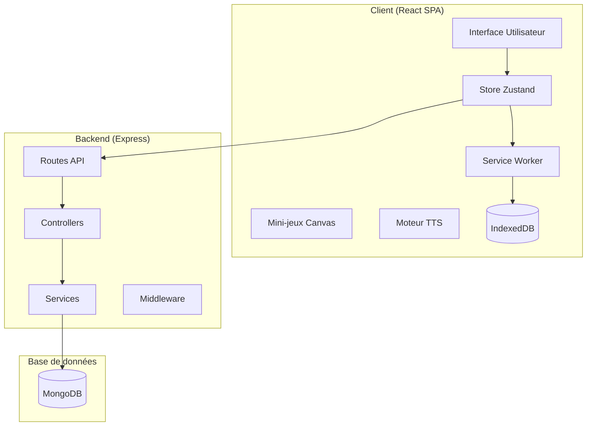

## Flux d'Authentification Parent

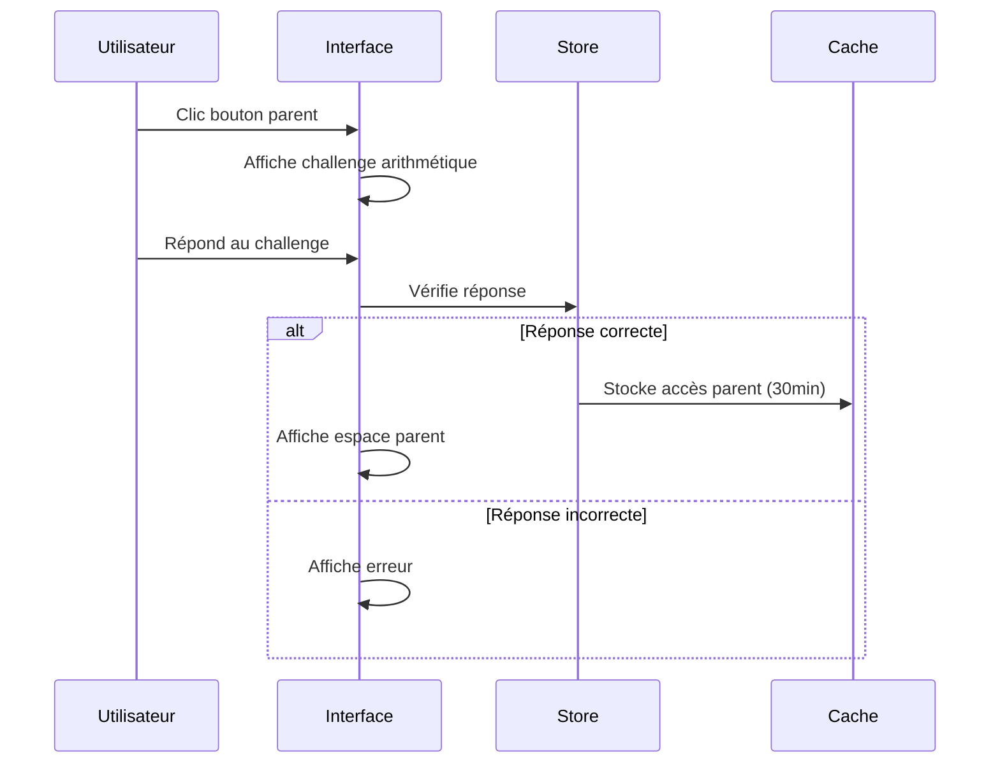

## Flux de Jeu

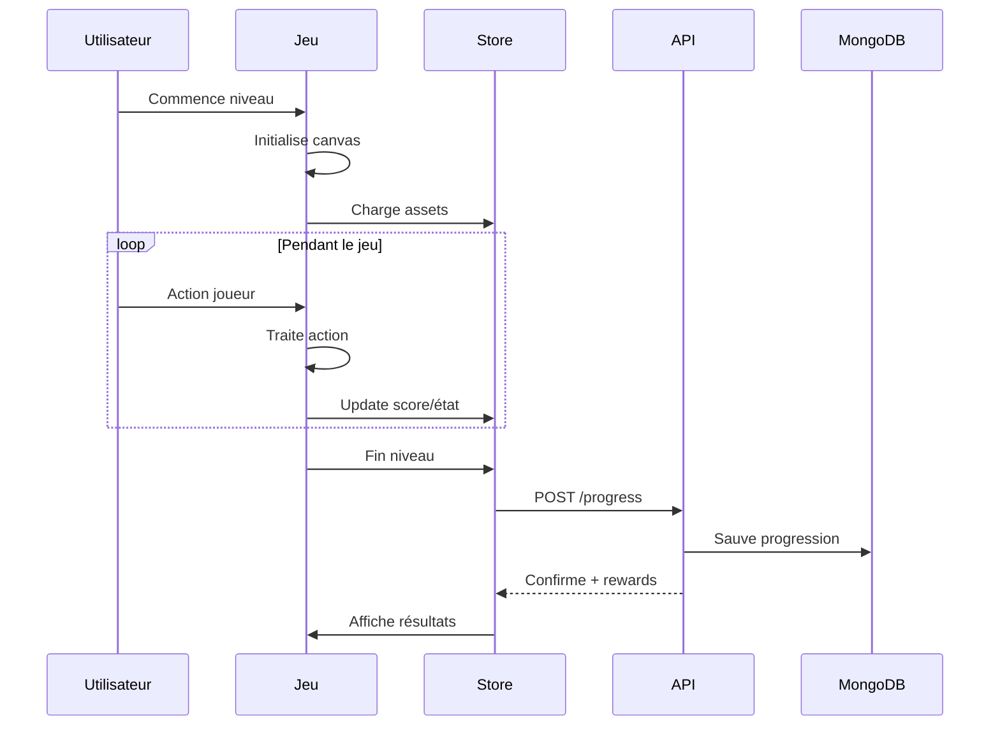

## Synchronisation Offline

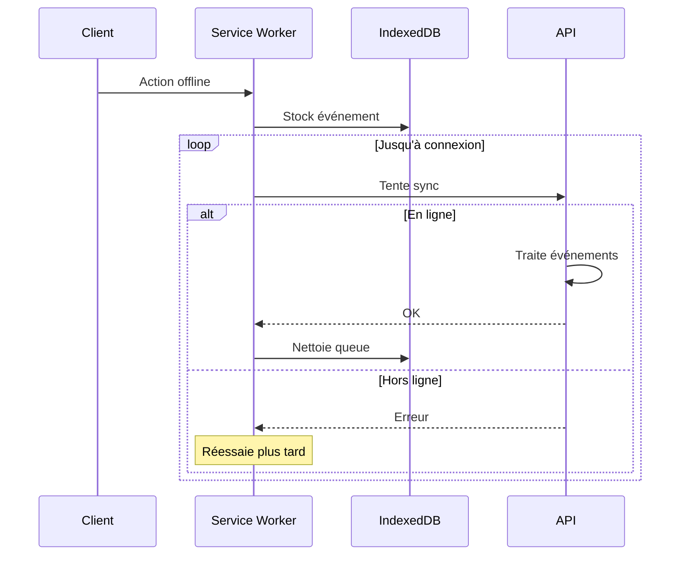

## Architecture Mini-jeux

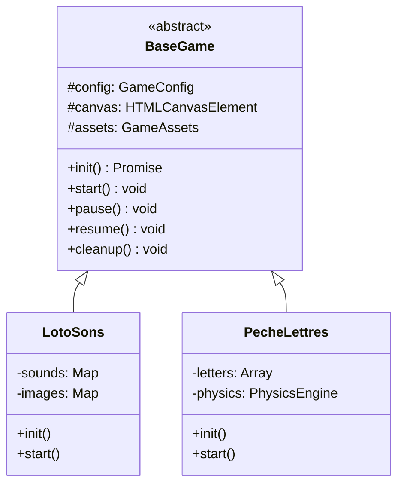

## Flux de Données

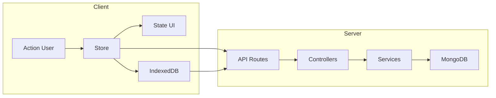

## Gestion d'État

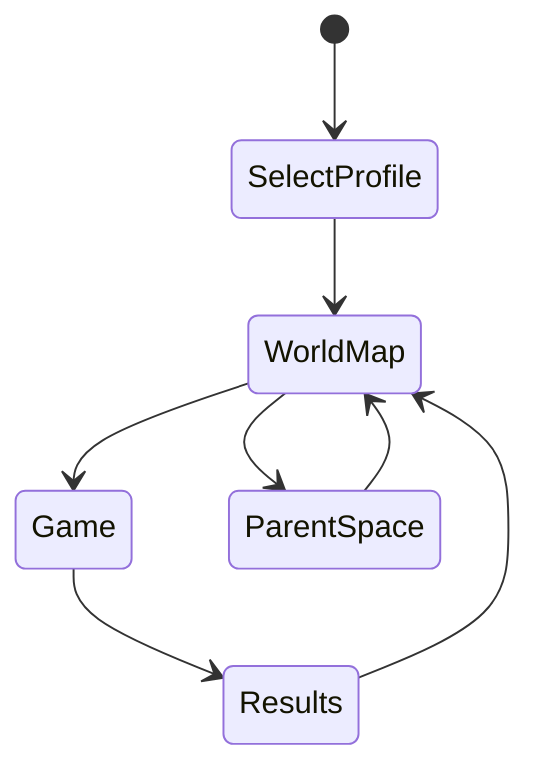

## Pipeline CI/CD (Suggestion)

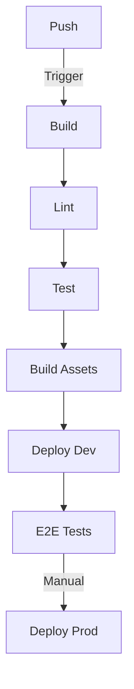

## Modèle de Données

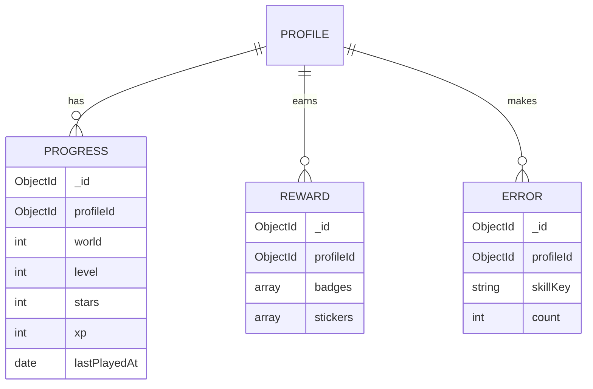

## Flux Audio et TTS

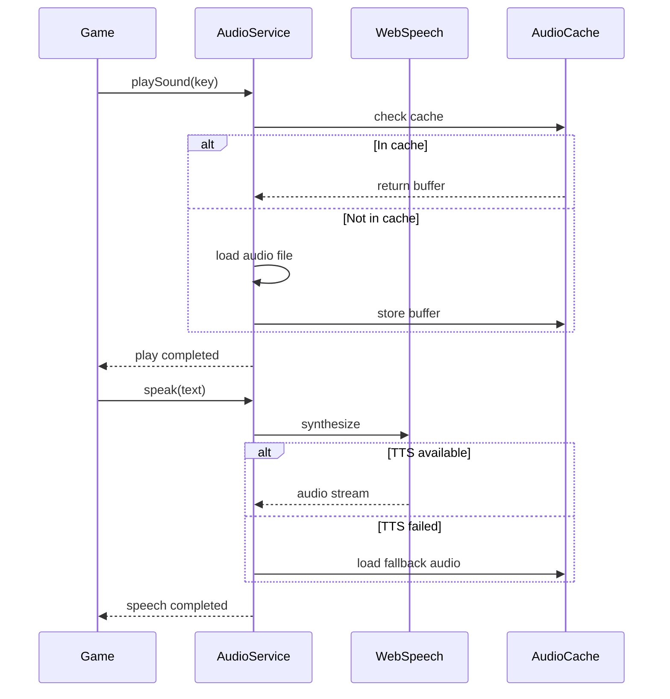

## Système de Récompenses

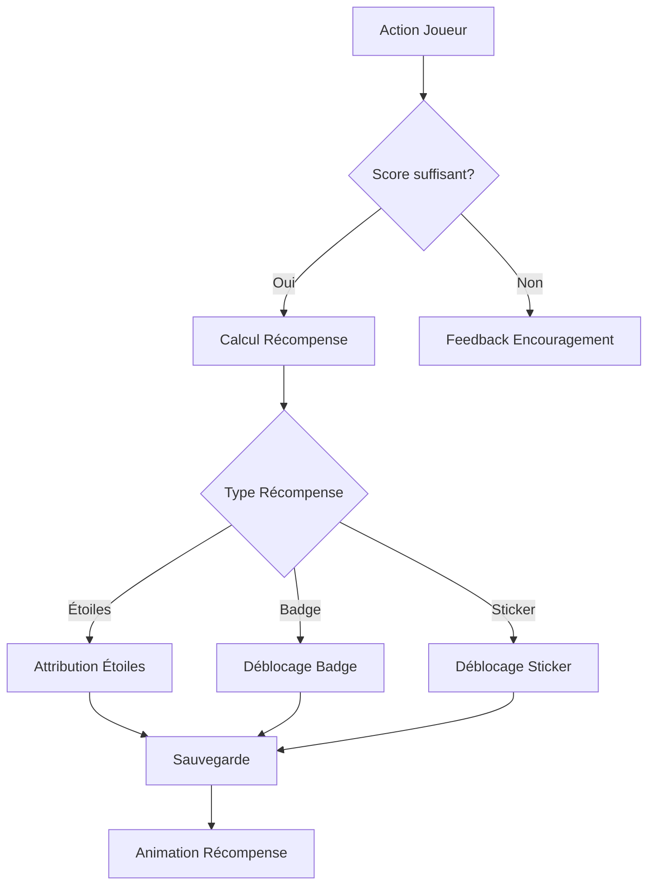